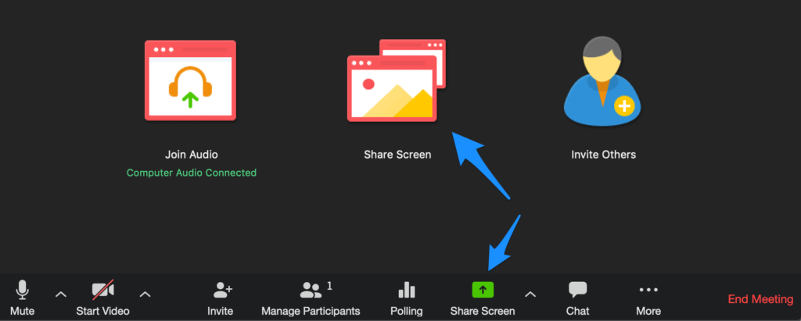

# JS Screen Recording

Screen recording is a Web application for capture it from the screen (desktop, specific application window or Chrome tab).

##### Screenshot




### Quick start
Download ScreenRecorder from Github releases and unpack it to any folder. Make sure the machine has installed Python3 or later.

```commandline
python3 -m pip install -r requirements.txt
python3 main.py --host 0.0.0.0 --port 8080
```

Open http://localhost:8080 then try it
